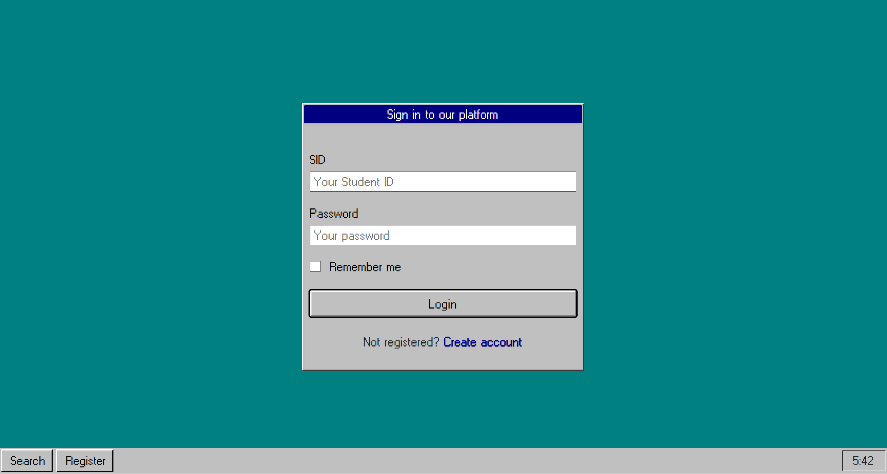
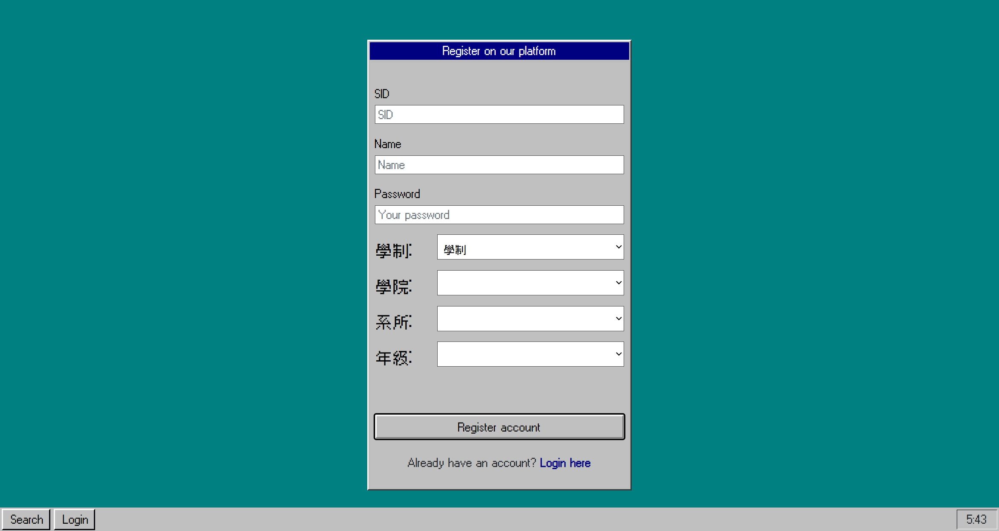
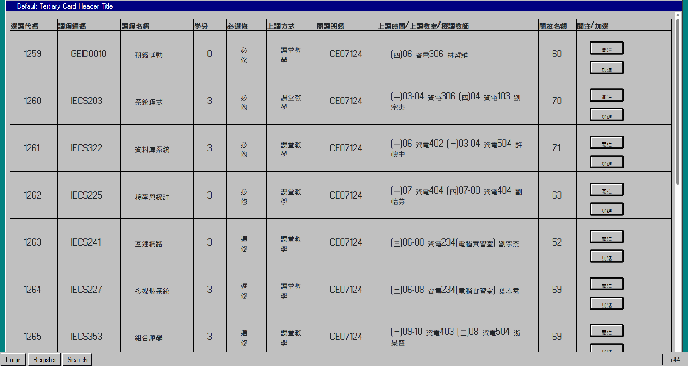
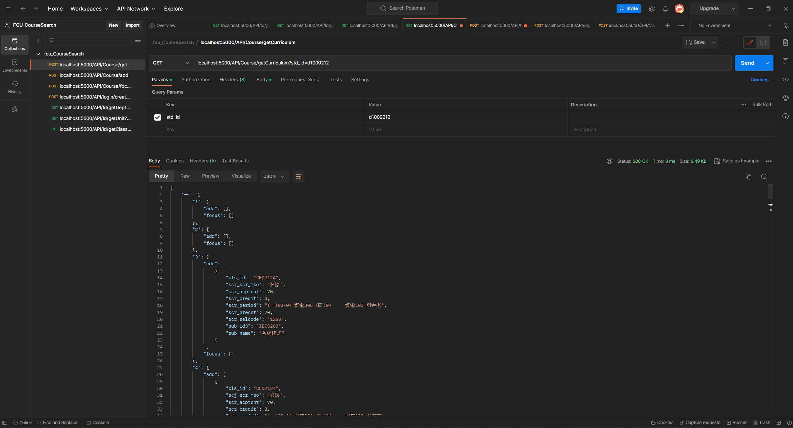
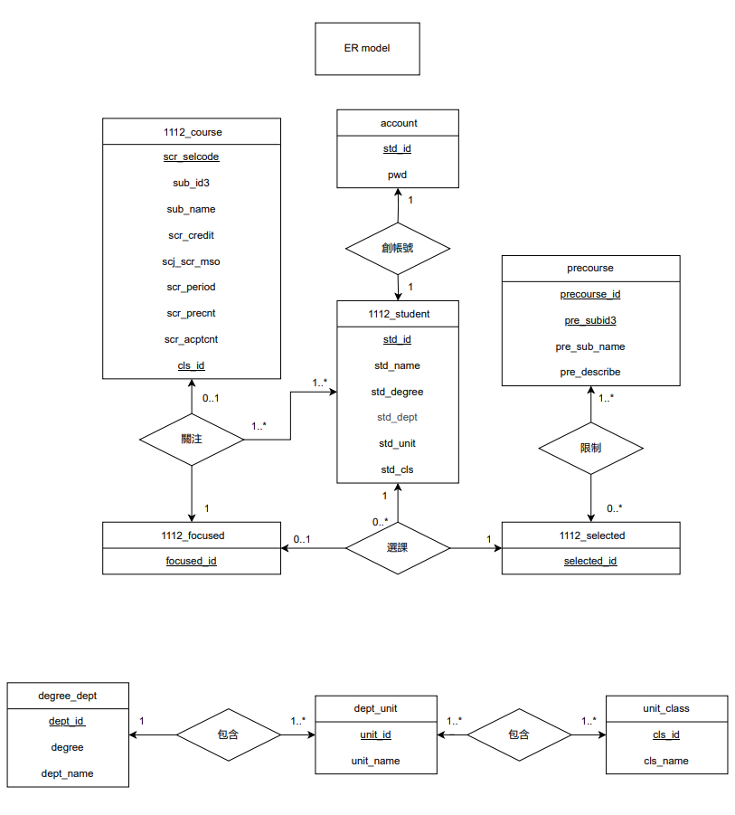

# FCU 選課系統 & 檢索系統
> IECS322 資料庫系統 (許懷中) 期中專題

## Main Window

## Feature

### 主畫面


### 登入畫面


### 註冊畫面


### 檢索結果


### API


## ER Model


## API

### Course

#### 取得課程列表
```
GET: /API/getCourse
args(year, sms)
```

#### 加選課程
```
POST: /API/Course/add
data(std_id, scr_selcode, cls_id)
```

#### 退選課程
```
POST: /API/Course/delete
data(std_id, scr_selcode, cls_id)
```

#### 關注課程
```
POST: /API/Course/focus
data(std_id, scr_selcode, cls_id)
```

#### 取消關注課程
```
POST: /API/Course/unfocus
data(std_id, scr_selcode, cls_id)
```

#### 取得課表
```
GET: /API/Course/getCurriculum
args(std_id)
```

### Login

#### 取得帳號
```
POST: /API/Login/getAccount
data(std_id, pwd)
```

#### 創建帳號
```
POST: /API/Login/getAccount
data(std_id, pwd, std_name, std_degree, std_dept, std_unit, std_cls)
```

### Id

#### 取得所屬該學制的學院
```
GET: /API/Id/getDept
args(degree)
```

#### 取得所屬該學院的學系
```
GET: /API/Id/getUnit
args(dept_id)
```

#### 取得所屬該學系的班級
```
GET: /API/Id/getClass
args(unit_id)
```

## 爬蟲

## 設定環境

### Vscode Python 虛擬環境

#### 建立虛擬環境
```
python -m venv venv
```

#### 啟動虛擬環境
```
.\venv\Scripts\Activate.ps1
```

#### 安裝套件
```
pip install -r .\env\requirements.txt
```

#### 關閉虛擬環境
```
deactivate
```

### Python 套件清單

#### pip 生成 requirements.txt

```
pip freeze > .\env\requirements.txt
```

#### pip 使用 requirements.txt

```
pip install -r .\env\requirements.txt
```

### 初始化資料庫

#### 使用 python 匯入
```
python .\database\Databaseinit.py
```

#### phpmyadmin 手動匯入

`.\database\sql\*.sql`

## 組員

邱柏宇 [Poyu39](https://github.com/poyu39)

吳念澤 [kokorosawa](https://github.com/kokorosawa)

徐葆驊 [benhsu0828](https://github.com/benhsu0828)

劉旭峰 [brian1130](https://github.com/brian1130)

葉展綸 [lavacookies](https://github.com/lavacookies)

